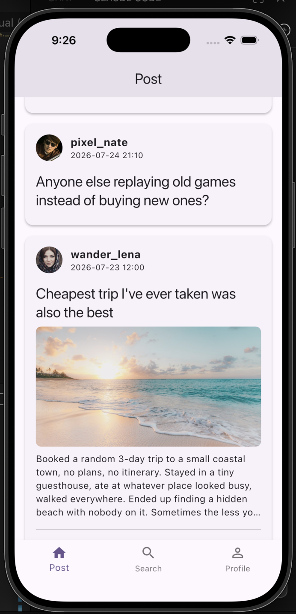
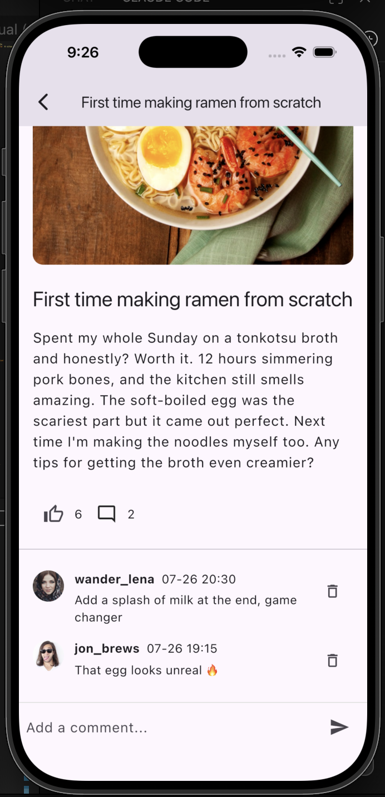
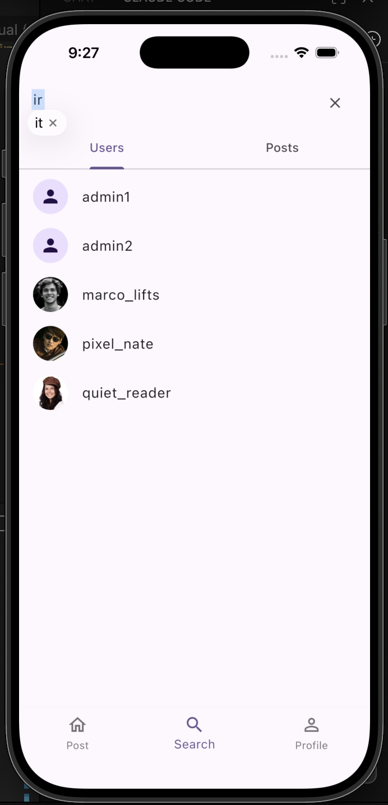
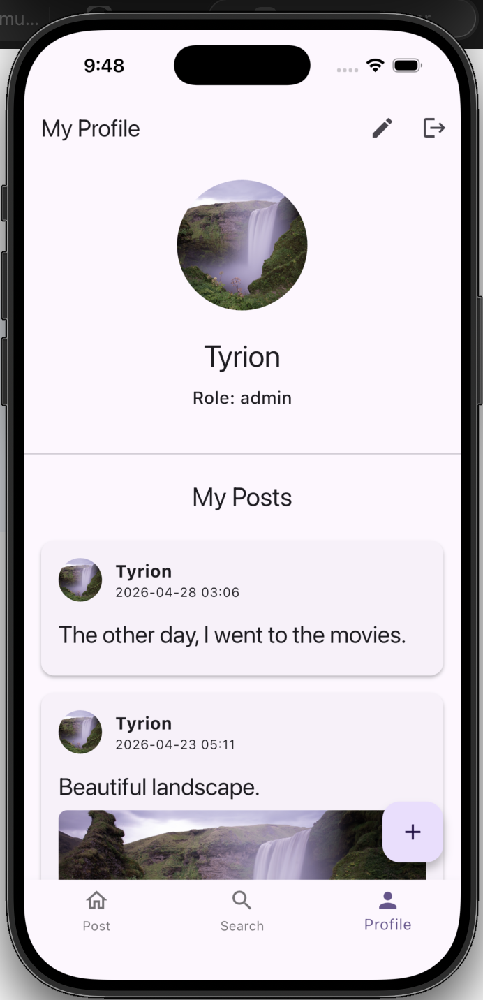

# Community Board App

🇪🇸 **Español** · [🇬🇧 English](README.en.md)

Una pequeña red social construida con **Flutter** y **Supabase**. Los usuarios pueden
registrarse, publicar posts (con imagen opcional), dar like y comentar los posts de otros,
buscar contenido y administrar su propio perfil.

El proyecto está organizado como un **monorepo** siguiendo los principios de
**Clean Architecture**, con una separación clara entre las capas de presentación, dominio y datos.

---

## ✨ Funcionalidades

- **Autenticación** — registro, inicio y cierre de sesión con email/contraseña (Supabase Auth).
- **Feed** — lista paginada de posts de toda la comunidad.
- **Posts** — crea, edita y elimina tus propios posts, cada uno con título, contenido e imagen opcional.
- **Likes** — da o quita like a los posts; los contadores se actualizan al instante.
- **Comentarios** — comenta los posts, edita y elimina tus propios comentarios.
- **Búsqueda** — busca posts por palabra clave.
- **Perfiles** — consulta el perfil de cualquier usuario y edita tu username y avatar.
- **Roles** — roles `user` / `admin` guardados por perfil.

---

## 📱 Capturas de pantalla

Capturas tomadas en el simulador de iOS.

| Feed | Feed (scroll) | Detalle del post |
| :--: | :--: | :--: |
|  |  |  |
| Lista paginada de posts de la comunidad, con imagen, likes y comentarios. | El feed carga más posts a medida que se hace scroll. | Post completo con su hilo de comentarios y campo para comentar. |

| Búsqueda | Mi perfil |
| :--: | :--: |
|  |  |
| Búsqueda con pestañas separadas para usuarios y posts. | Perfil propio con sus posts, edición y cierre de sesión. |

---

## 🏗️ Arquitectura

El código se divide en la app de Flutter más tres paquetes internos de Dart, conectados
mediante inyección de dependencias. Las dependencias apuntan **hacia adentro**:
presentación → dominio ← datos.

```
community_board_app/
├── bloc_app/                # Aplicación Flutter (capa de presentación)
│   └── lib/
│       ├── core/            # DI, router, event bus, widgets y utilidades compartidas
│       └── features/        # auth · post · profile · search · splash
│           └── <feature>/presentation/
│               ├── blocs/   # Gestión de estado con BLoC
│               ├── pages/   # Pantallas
│               └── widgets/ # UI reutilizable
│
└── packages/
    ├── core/                # UseCase base, errores (Failure), constantes, utils
    ├── domain/              # Entidades, interfaces de repositorio, casos de uso (Dart puro)
    └── data_supabase/       # Implementaciones de Supabase (data sources, modelos, repos)
```

**Capas**

| Capa           | Paquete         | Responsabilidad                                                         |
| -------------- | --------------- | ---------------------------------------------------------------------- |
| Presentación   | `bloc_app`      | UI, pantallas y BLoCs. Reaccionan al estado y despachan eventos.       |
| Dominio        | `domain`        | Reglas de negocio: entidades, casos de uso e **interfaces** de repositorio. |
| Datos          | `data_supabase` | Repositorios concretos, data sources remotos y DTO/modelos para Supabase. |
| Núcleo común   | `core`          | Bloques transversales (`UseCase` base, tipos de error, utilidades).     |

### Stack tecnológico

- **Gestión de estado:** `bloc` / `flutter_bloc`
- **Inyección de dependencias:** `get_it` + `injectable`
- **Ruteo:** `go_router`
- **Manejo funcional de errores:** `fpdart` (resultados estilo `Either`)
- **Backend:** `supabase_flutter` (Auth · Postgres · Storage · RPC)
- **Imágenes:** `image_picker`, `cached_network_image`
- **Configuración:** `flutter_dotenv`
- **Utilidades:** `equatable`, `intl`, `uuid`, `string_validator`, `stream_transform`

---

## 🗄️ Backend (Supabase)

El backend corre por completo en Supabase. El esquema `public` tiene cuatro tablas,
todas protegidas con **Row Level Security (RLS)**:

| Tabla      | Propósito                                                            |
| ---------- | ------------------------------------------------------------------- |
| `profiles` | Perfil público por usuario (`username`, `avatar_url`, `role`). Relación 1:1 con `auth.users`. |
| `posts`    | Posts (`title`, `content`, `image_url`, `likes_count`, `comments_count`). |
| `comments` | Comentarios asociados a un post y a un usuario.                     |
| `likes`    | Un registro por (post, usuario) que da like.                       |

**Automatización en la base de datos**

- `on_auth_user_created` → crea automáticamente un registro en `profiles` cuando un usuario
  se registra (el username viene de los metadatos del registro).
- `on_like_change_update_post_likes_count` → mantiene `posts.likes_count` sincronizado al dar/quitar like.
- `on_comment_change_update_post_comments_count` → mantiene `posts.comments_count` sincronizado.
- Triggers `set_*_updated_at` → mantienen las columnas `updated_at`.

**Funciones RPC** (llamadas desde la app para respuestas atómicas con forma de vista):
`create_post_and_return_post_display_view`, `update_post_and_return_post_display_view`,
`create_comment_and_return_comment_display_view`, `update_comment_and_return_comment_display_view`,
`handle_like`, `get_my_posts`, `search_posts`, `update_user_profile`, `get_user_role`, `is_admin`.

Las imágenes de los posts se guardan en **Supabase Storage** y se referencian por URL desde `posts.image_url`.

---

## 🚀 Puesta en marcha

### Requisitos

- Flutter SDK `^3.10.4` (Dart 3)
- Un proyecto de Supabase (URL + anon key)

### 1. Clonar e instalar

```bash
git clone <url-de-tu-repo>
cd community_board_app/bloc_app
flutter pub get
```

> La app depende de los paquetes locales bajo `../packages` mediante dependencias por ruta,
> así que `flutter pub get` desde `bloc_app/` resuelve todo.

### 2. Configurar el entorno

Crea un archivo `.env` dentro de `bloc_app/` con tus credenciales de Supabase:

```env
SUPABASE_URL=https://TU-PROYECTO.supabase.co
SUPABASE_ANON_KEY=tu-anon-key
```

`.env` se carga al arranque con `flutter_dotenv` y está declarado como asset de Flutter en
`pubspec.yaml`. **No lo subas al repositorio.**

### 3. Generar código

El grafo de DI y la serialización JSON usan generación de código:

```bash
dart run build_runner build --delete-conflicting-outputs
```

### 4. Ejecutar

```bash
flutter run
```

---

## 🧪 Datos de demo

La base de datos puede poblarse con usuarios y posts de demo para que el feed se vea realista.
Las cuentas de demo usan la contraseña compartida `Demo1234!` (solo para pruebas locales — nunca
la reutilices para algo real). Usuarios de ejemplo: `ava_makes`, `marco_lifts`, `pixel_nate`,
`wander_lena`, `quiet_reader`, `jon_brews`.

---

## 📂 Referencia de la estructura

```
bloc_app/lib/features/<feature>/presentation/{blocs,pages,widgets}
packages/domain/lib/src/<feature>/{entities,repositories,usecases}
packages/data_supabase/lib/src/<feature>/{datasources,models,repository}
```

Cada feature (auth, post, profile, search) sigue la misma forma en las tres capas, lo que hace
que el código sea predecible de navegar y de extender.
